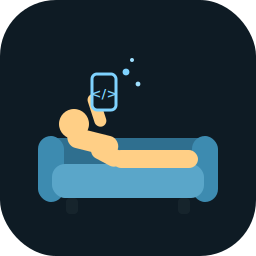

<p align="center">
  
</p>

<h1 align="center">Slouch</h1>

<p align="center"><b>Vibe-code your Expo apps from your phone</b> — prompt an AI agent, watch your app hot-reload live in your hand. Sofa first, bus next.</p>

<p align="center"><sub>⚠️ Early-stage / work in progress — opinionated personal tooling, expect rough edges.</sub></p>

---

It's the missing glue between two halves that already work:

- **The transport** (battle-tested by [@levelsio](https://levels.io) and others):
  a phone terminal → SSH/Mosh → `tmux` → an AI coding agent editing your real repo.
- **The preview** (Expo's own Fast Refresh): Expo Go on the same phone updating the
  instant a file is saved.

Slouch wires them together, opinionated for the case where **every project is
an Expo project**.

```
Phone: Blink + Mosh ──► Mac: tmux ─┬─ metro    (npx expo start)
                                   ├─ claude   (Claude Code)
                                   ├─ codex    (Codex CLI)
                                   ├─ shell
                                   └─ awake    (caffeinate -dis)
                                          │ agent saves files
                                          ▼
                                   Metro Fast Refresh
                                          │
Phone: swipe to Expo Go ◄──────────────────┘  (live preview)
```

## What you get

- **`expo-dev`** — one command boots (or re-attaches) a tmux session per project,
  with Metro, both agents, a shell, and a keep-awake window already running.
- **`expo-dev init`** — drops Expo-tuned `CLAUDE.md` + `AGENTS.md` into a project so
  both agents understand the live-reload contract (don't break Fast Refresh, flag
  changes that need a native rebuild, never restart Metro).
- **Docs** for the connection layer (Blink + Mosh + tmux) and going cellular
  (Tailscale + `--tunnel`).

## Install

```bash
git clone git@github.com:GG628/slouch.git
cd slouch
./install.sh          # sources expo-dev in ~/.zshrc, installs global Expo rules
source ~/.zshrc
```

Requires `tmux` (`brew install tmux`). Update later with `git pull`.

## Use

In any Expo project:

```bash
expo-dev init     # once per project — writes CLAUDE.md + AGENTS.md
expo-dev          # boot the session (LAN); or `expo-dev --tunnel` for cellular
```

Then from your phone: open Expo Go on your project, open your terminal app, attach
to the tmux session, and prompt away. See [`docs/`](docs/) for the phone side.

## The three levels

1. **Desk** — `expo-dev` on the Mac, Expo Go on the phone. Same as always, just tidy.
2. **Sofa** (same Wi-Fi) — phone terminal (Blink + **Mosh**) into the Mac; Mosh keeps
   the session alive across phone sleep so there's no passcode/reconnect loop.
   See [`docs/1-connection.md`](docs/1-connection.md).
3. **Bus** (cellular) — add Tailscale and run `expo-dev --tunnel`.
   See [`docs/2-cellular.md`](docs/2-cellular.md).

Agent strategy (Claude Code + Codex, both in the session) is in
[`docs/3-agents.md`](docs/3-agents.md).

## Why not just use the Codex / ChatGPT mobile app?

You can — but the app's lock-screen timeouts and sleep behaviour fight you. A
phone terminal + **Mosh** survives sleep and network changes, runs whichever agent
you want, and never asks for a passcode mid-flow. Slouch leans on that.

## License

MIT
